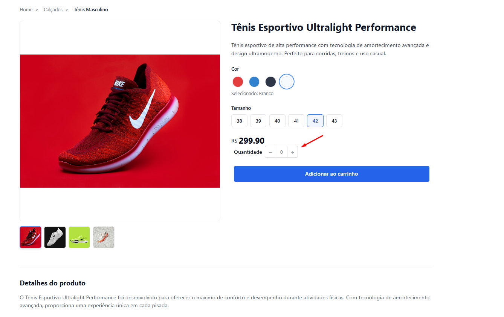
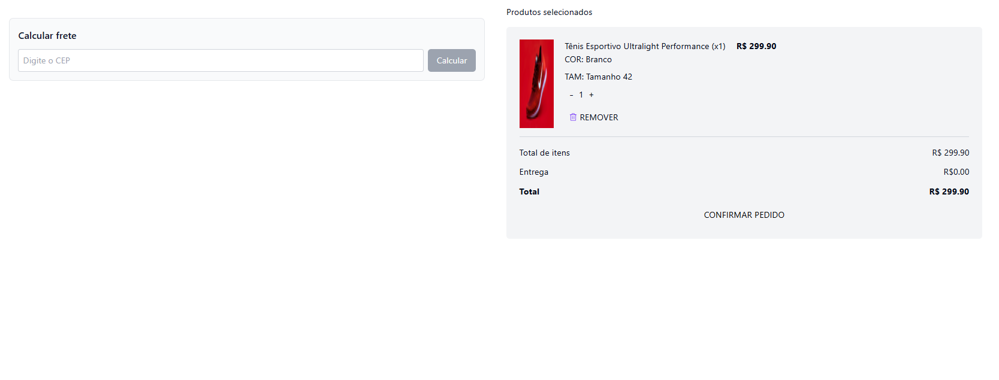
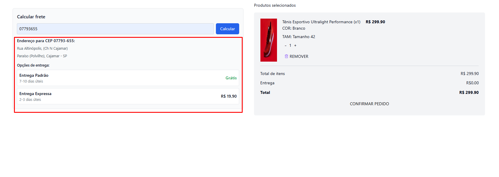
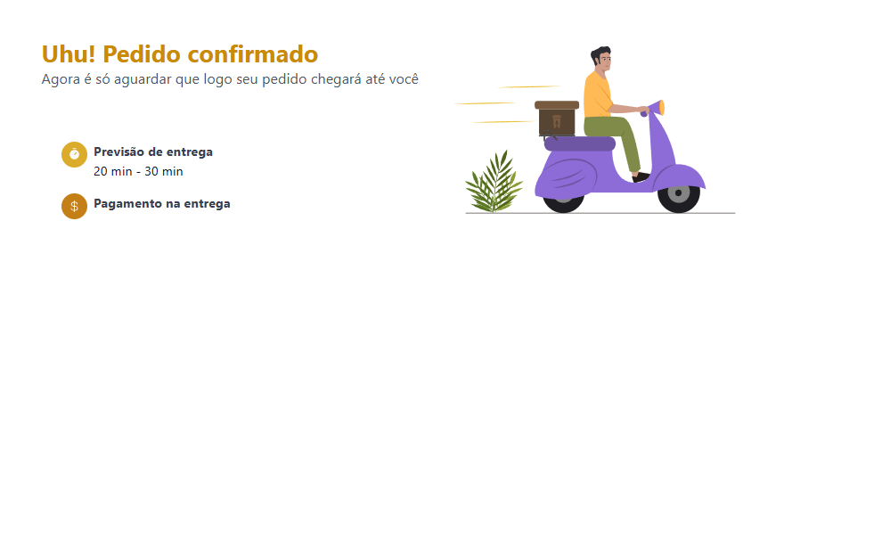

# 🛒 Projeto - Página de Produto com Checkout

Este projeto simula a experiência de compra de um produto em um e-commerce, desde a visualização do item até a finalização do pedido. Ele foi desenvolvido com foco em usabilidade, persistência de dados no navegador e integração com API externa de CEP.

---

## ✅ Funcionalidades

- **Imagens do Produto**
  - Uma imagem principal que ocupa cerca de **35% da tela**.
  - Abaixo da imagem principal, miniaturas com as demais imagens.
  - Ao **clicar em uma miniatura**, a imagem principal é atualizada dinamicamente.

- **Informações do Produto**
  - Título e preço exibidos em destaque.

- **Seletores Dinâmicos**
  - Seleção de **cor** e **tamanho**.
  - Os campos são gerados **dinamicamente a partir de arrays**, garantindo flexibilidade e manutenção fácil.

- **Disponibilidade de Entrega**
  - Campo para digitação de **CEP**.
  - O CEP é consultado pela API pública: [viacep.com.br](https://viacep.com.br/)
  - Ao digitar um CEP válido, o endereço completo é exibido.

- **Persistência Local**
  - Todas as interações do usuário (cor, tamanho, produtos no carrinho) são salvas no `localStorage`.
  - Os dados permanecem salvos por **15 minutos**, mesmo que a página seja atualizada.

---

## 🖼️ Prints do Projeto

### Página do Produto

> Escolha de variantes de cor e tamanho com imagens dinâmicas



---

### Checkout - Sem CEP

> Tela inicial do checkout com produtos adicionados



---

### Checkout - Com CEP preenchido

> Exemplo após preenchimento e consulta de CEP



---

### Pedido Confirmado

> Tela final após confirmação do pedido



---

## 🧪 Tecnologias Usadas

- **React + TypeScript**
- **React Router DOM**
- **TailwindCSS**
- **React Hook Form**
- **Taq stack + fetch** para requisições 
- **API ViaCEP** para consulta de endereço

---

## 🚀 Como executar

1. Clone o repositório:
   ```bash
   git clone https://github.com/seu-usuario/seu-repositorio.git
